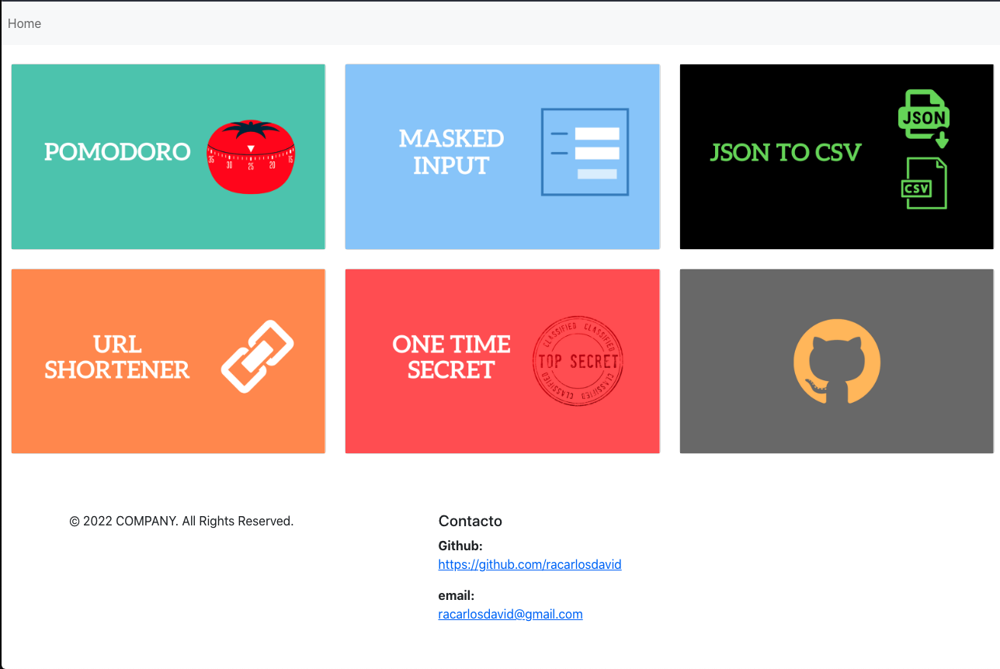
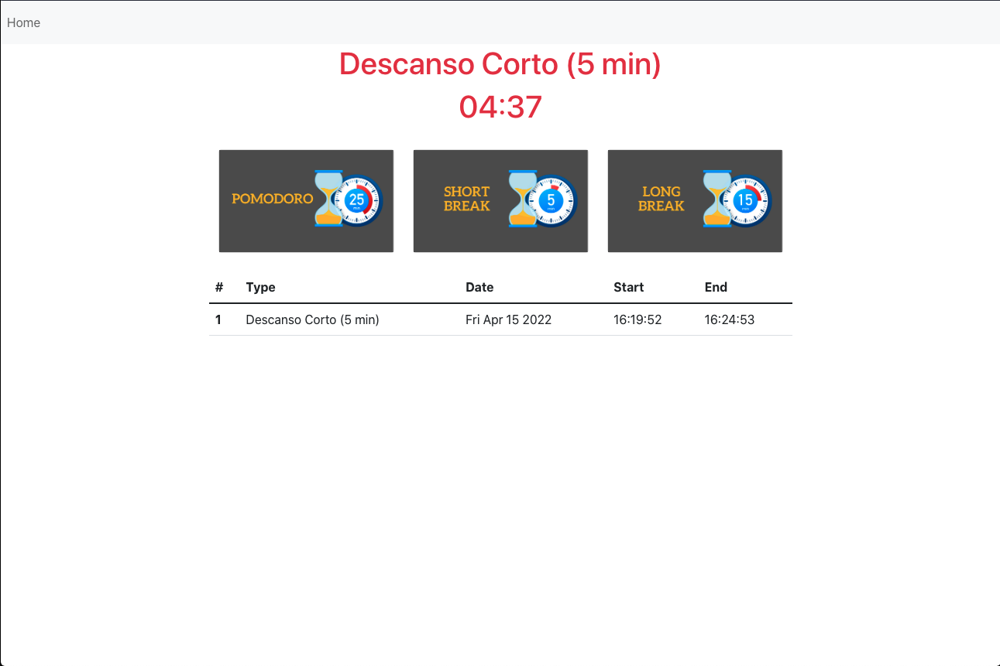

# TFive


## Descripción
El proyecto consiste en 5 aplicaciones diferentes las cuales se describen a continuacion:
- [ Pomodoro ]()  App para la gestión del tiempo, utilizando la Técnica Pomodoro.

- [ Masked Input ]() App para captura de datos del usuario, para la solicitud de visa.

- [ JSON to CSV ]() Herramienta online para transformar un formato JSON a CSV

- [ URL Shortener ]() Esta app permite acortar URLs válidas, creando una URL corta que redirija a nuestra URL original.

- [ One time Secret ]() Applicaion que permite crear secretos que solamente se puedan ver una vez, y luego sean destruidos

## Herramientas Utilizadas
- [ React ]()
- [ Express ]()
- [ Docker ]()
- [ Google Cloud Platform ]()

### Final Project Online
Puedes probar la aplicacion en linea, esta disponible en:
```
https://tfive-mlsdj2uhea-uc.a.run.app
```

## Architecture 

La aplicacion cuenta con una arquitectura de microservicios por lo que el backend de URL Shortener y el backend  de  One time Secret esta desplegados en gcp en el servicio de cloud run, en cuanto al frontend de igual manera se encuentra desplegado utilizando este mismo servicio.

## Home 

En la pagina principal se puede observar las distintas aplicaciones disponibles, de manera que al dar click en la applicacion a utilizar el usuario sera redirigido a esta y podra comenzar a utilizar dicha app.

## Pomodoro 
La app pomodoro es capaz de manejar 3 funcionalidades:
1. Iniciar un nuevo pomodoro (25min)
1. Iniciar un descanso corto (5min)
1. Iniciar un descanso largo (15min)


## Masked Input 


## JSON to CSV 
La app JSON to CSV es una herramienta online para transformar un formato JSON a CSV. La UI cuenta con 2 inputs, uno para ingresar el JSON y otro para mostrar el resultado ya en formato CSV.
La UI cuenta con distintos botones:
1. Un botón para hacer la transformación de JSON a CSV.
2. Un botón para formatear el JSON de entrada.
3. Un botón para ver un ejemplo del json de entrada.
4. Un botón para limpiar la entrada y el resutado.


## Masked Input 
La app Masked Input permite acortar URLs válidas, creando una URL corta que redirija a nuestra URL original. Para crear un link corto solamente es necesario ingresar el link y presionar el boton create y asi de sencillo se obtendra el link nuevo el cual el suario podra usar para acceder al link original. Tambien se cuenta con un contador de las veces que se a utilizado el link de manera que si se desea ver este conteo solamente es necesario presionar el boton Logs y se procedera a desplegar las veces que se a utilizado un link.


## Masked Input 
La app Masked Input permite acortar URLs válidas, creando una URL corta que redirija a nuestra URL original. Para crear un link corto solamente es necesario ingresar el link y presionar el boton create y asi de sencillo se obtendra el link nuevo el cual el suario podra usar para acceder al link original. Tambien se cuenta con un contador de las veces que se a utilizado el link de manera que si se desea ver este conteo solamente es necesario presionar el boton Logs y se procedera a desplegar las veces que se a utilizado un link.


### Clonar el repositorio
Para clonar el repositorio ejecuta el comando:
```
git clone https://github.com/racarlosdavid/TFive.git
```